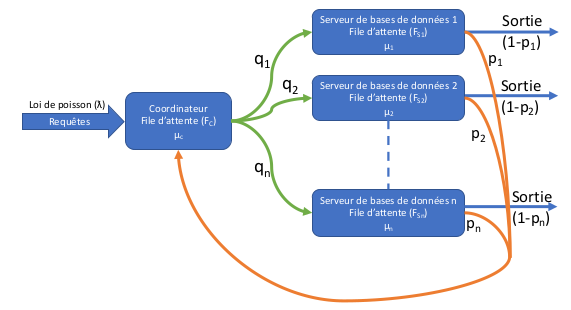

# Projet_MED
### CAMARA Noël, Sow Kalidou
#### M1 IWOCS, groupe 2
##### Janvier 2022

## Introduction
L’objectif du sujet est d’implémenter un réseau de filles d’attentes pour simuler une base de données distribuée.\
Un coordinateur dans lequel les requêtes arrivent suivant la loi de poisson de parmetre lambda,va repartir les requêtes sur les différents serveurs de base de données pour qu'elles soient traiter.\
Chaque serveur possède les probabilté p et q qui représentes, la probabilté que la requete s'oriente vers ce serveur et la probabité que la requête apres le traitement sort du système ou revient au coordinateur.\
Le schema ci-dessous illustre système. 

## 1. analyse-conception
Pour implémenter le programme, nous avons utilisé trois classes: 
- Classe Serveur: qui présente un serveur et defini par son identifiant, la probabilité d'entrée q, la probabilité de sortie 1-q (p), le temps de traitement des requêtes et une liste chaînée pour réunir les différentes requêtes qui arrivent au serveur et un nombre qui représente le nombre de requêtes envoyer par le coordinateur au serveur. 

- Classe Requete : qui représente une requête dans le système definie par son identifiant, sa date initiale de rentrée dans le système, sa date courante  et sa date de sortie du le système.

- Classe ReseauFilesAttentes: dans laquelle nous avons définie tous les attributs et méthodes nécessaire à la répartition des requêtes et à la simulation.

Résumé des méthodes obtenues :
- FindX(double lambda): génère une valeur suivant la loi de poisson pour alimenter le coordinateur.

- addRequeteC(Requete r): permet l'ajout de requetes dans le coordinateur.

- triRequetes(): permet de trier les requêtes du tableau coordinateur.

- triSortie(): permet de trier les requêtes sorties des serveurs suivant la date de sortie des requêtes. Elle permet aussi d'ajouter des requêtes à la la liste chaînée qui doit comporter toutes les requêtes sorties de tout les serveurs.

- TempsTraitementR(ArrayList<Requete> req):permet de réceptionner et de traiter les requêtes arrivant sur le serveur.
 
- TempsMoyen(): permet de calculer le temps moyen passé dans le système par une requête depuis sa date initiale de sa rentrée dans le système jusqu’à sa date de sortie de système.

- -simulation(): méthode principale qui oriente les requêtes vers les serveurs et qui effectue également la principale partie de la simulation.

- supprimerSortieRequete(): supprime de la liste chaînées des requêtes en sortie toutes les requê-
tes lesquelles le temps de sortie est supérieur à la durée de simulation.

- analyseRequete(int id): Elle permet d'analyser la requete du tableau sortie,renvoie null, s'il n'existe pas dans le tableau.

- generateData(String filename, String partieNom, String contenu): enregistre les données générées dans un fichier.
## 2. Les différentes simulations effectuées
On suppose que les probabilités d'entrée q et sortie p sont identiques pour tous les serveur,
c'est à dire que pour chaque serveur q=1/nombre de serveurs et\
p=1/nombre de serveurs).\
On fait une simulation sur deux serveurs: q=1/2 et p=1/2.\
On fait une simulation sur une durée de 100000 ms.

## 3. Réponses aux questions
On constate une convergence dans le système. Cette convergence se caractérise par un même temps de traitement des requêtes dans les deux serveurs.

- Le nombre de requetes traitées (sorties) de serveur numero 1 est 149
- Le nombre de requetes traitées (sorties) de serveur numero 2 est 172

- Le nombre de requêtes entrées dans le système durant la période de simulation est : 1872
- Le nombre de requêtes sorties dans le systeme durant la periode de simulation est : 226

- Le nombre de requetes presentes dans le système : 590
- Le temps  moyen de traitement des requetes est: 40286.80306887542

[Simulation temps moyen de traitement des requêtes en fonction de (ƛ)](tempsmoyen_lambda.png)

[Simulation temps moyen de traitement des requêtes en fonction de nombre de serveurs](tempsmoyen_nbserveurs.png)

## 4. Analyse du théorême de Jackson

Les clients sont présentés un par un dans chaque file. Le i-ième serveur va de manière markovienne, avec un taux de service μi(ni) qui concerne le nombre (ni) de clients présents dans la file. Lorsque (ni) clients sont présents dans la file, le temps de service d’un client est exponentiel de paramètre μi(ni). Donc en général le théorême de jackson est dans le cas ou (λ) varie en fonction du nombre de clients dans le réseau et les taux de services varient en fonction des (k).
Les séléctions aléatoires des clients en entrée et en sortie de chaque file, les temps de service et les temps d’inter-arrivée sont des variables aléatoires indépendantes en commun. Les files sont numérotées de 1 à K. Un client arrive de l’extérieur, noté comme une 0-ième file, il parcourt un certain nombre de files de manière aléatoire, ensuite se dirige vers l’extérieur, noté comme une (K + 1)-ième file. La suite des files parcourues par un client est une chaîne de Markov sur {0, . . . , K + 1}, partant de 0 et telle que K + 1 est un état absorbant. Un client qui rentre dans le système ne peut pas y rester bloqué. Certainement il sortira du sytème.
L’état du système sera codé par un vecteur d’entiers n = (n1, . . . , nk), dont la i-ième coordonnée représente le nombre de clients présents dans la file numéro i. Le temps moyen de présence représente la durée de vie d’une requête dans notre système de base de
données distribuée depuis son arrivée au coordinateur jusqu’à sa sortie et le nombre moyen de requêtes dans le système est lié en premier degré à la valeur de lambda.

## 5. Amélioration sur les performances du système
On a remarqué une amélioration des performance sur le temps lorsqu'on augmente la valeur de qi pour les serveur avec lesquels le temps moyen du service est minimal.
Le routage dynamique envoie les requêtes au serveurs les moins chargés. Il permet donc d'améliorer le temps de sortie des requêtes (les serveurs) dont le temps de réaction est minimal.
Ensuite on constate une évolution du temps de réaction dans les requêtes si on modifie les probabilités de routage qi ou lorsqu'on utilise le routage dynamique.

## 6. Répartition du travail
On a travaillé ensemble durant toutes les étapes du projet.

